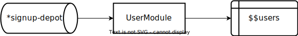
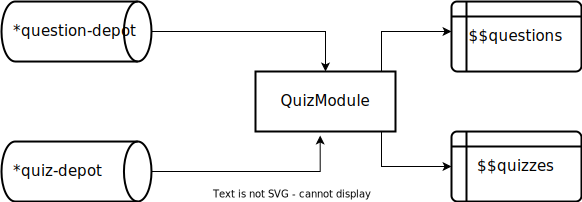
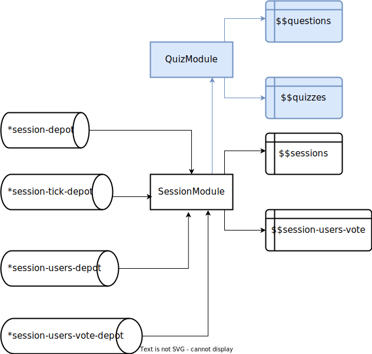

# Demo Rama Electric

> Before continuing to read this beautiful readme, I must say something: I'm just a single user who loves these new libraries. My code reflects my experience and learning about this new technology, so there may be errors or a better way to achieve the same tasks.

## Rama

From [RedPlanetLabs](https://redplanetlabs.com/), Rama is a complete system to build scalable backends:

> **Rama** is a new programming platform that reduces the cost of building scalable backends by 100x.

For more information about it, check the [documentation](https://redplanetlabs.com/docs/~/index.html#gsc.tab=0).

## Electric

From [Hypperfiddle](https://www.hyperfiddle.net/), Electric is a new library to handle client/server communication and more:

> Electric is a **reactive and network-aware Clojure/Script DSL**.

For more information about it, check the [documentation](https://github.com/hyperfiddle/electric). I recommend looking into [missionary](https://github.com/leonoel/missionary) (because Electric is based on it). There is a very cool [repository](https://github.com/dustingetz/missionary-quickstart) about it.

## The Demo

https://github.com/jeans11/demo-rama-electric/assets/7700239/e7f0352b-cf49-4c6a-bb89-f686641325cb

### Context

It's a multiplayer quiz app. The idea behind it is to demonstrate the capabilities of this new technology to easily create complex real-time features. This two libs can enter the dev of web application in the next level:

> Electric handles the network between front/back for you. Rama handles scale and make database more flexible.
> All in a reactive way!
> https://twitter.com/jbhxyz/status/1696466288216768631

### Entities

There are four entities present in the demo:

- `user`
- `question`
- `quiz`
- `session`

### Code Organization

[Polylith](https://github.com/polyfy/polylith) is used here. The documentation can be found [here](https://polylith.gitbook.io/polylith).

Folders explanations:

- `development`: entry point to dev.
- `bases/server`: server to handle Electric WebSocket and serve the UI. Start the Rama backend as well. There is a specific namespace for this: `dre.server.rama`.
- `bases/web-ui`: the UI of the app.
- `components/belt`: all the utilities of the app.
- `components/user`: everything related to the `user` entities.
- `components/quiz`: everything related to the `quiz` and `question` entities.
- `components/session`: everything related to the `session` entities.

#### UI

The UI contains some views:

- `views/login.cljc`: handles the signup/login form (`/signup`).
- `views/board.cljc`: the main template when the user is logged in.
- `views/quiz_list.cljc`: All the quizzes present in the `quizzes.edn` (`/quizzes`).
- `views/quiz_item.cljc`: When a quiz is clicked, it shows some information about this quiz (`/quizzes/<quiz-id>`).
- `views/quiz_session.cljc`: The heart is here! It displays the quiz currently played by some users (`/sessions/<session-id>`).

#### Backend

> This section is related to Rama, so be sure to view the doc of Rama before.

##### User

`*signup-depot` receives all the data related to the signup form. The `UserModule` consumes this and stores it in the `$$users` pstate. This pstate looks like this: `{<user-id> {:email String :display-name String :password String}}`.

##### Quiz/Question

Like the `User` part before, the `Quiz/Question` is pretty similar, except there are different depots and pstates for `quiz`/`question`.

##### Session

In this part, there are a bit more stuff. First things first, the `SessionModule` uses the `$$quizzes` and `$$questions` of the `QuizModule` as `mirror pstates` (the blue part).

Like the other parts, there is a depot (`*session-depot`) responsible for receiving new sessions and storing them in `$$sessions`.

The other depots like `*session-users-depot` or `*session-users-vote-depot` are used to handle user interactions. The first one (`*session-users-depot`) is used to handle user connection inside a session. Like a user comes into a session or a user leaves a session. This data is consumed by the `SessionModule` to update the `user-ids` field inside the `$$sessions`.

The second one (`*session-users-vote-depot`) is used to handle user votes inside a session. The `SessionModule` uses it to store it in the `$$session-users-vote`. This pstate looks like this: `{<session-id> {<question-id> {<user-id> {:vote String}}}}`.

There is also another depot: `*session-tick-depot`. This depot is used to schedule the start of a session and questions of a quiz. Thanks to the `TopologyScheduler` inside the `rama-helpers` to achieve this.

## Start the app

- `bb dev`
- Connect to the nREPL with your favorite IDE.
- Go to the `development/src/dev/core.clj` namespace and evaluate it.
- Launch the `start!` function.
- Visit the [http://localhost:8080/signup](http://localhost:8080/signup).

## Next Development

- Add validation schema.
- CRUD to create/update entities.
- Improve UI file splitting (with shadow).
- Try to deploy it!

